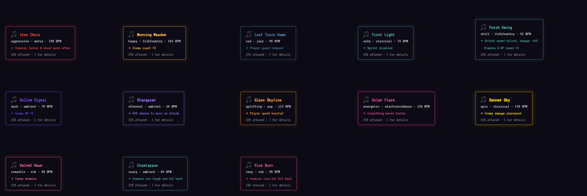
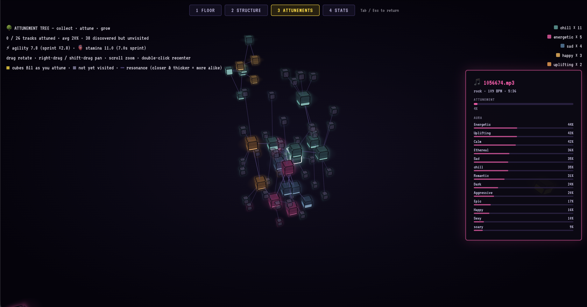
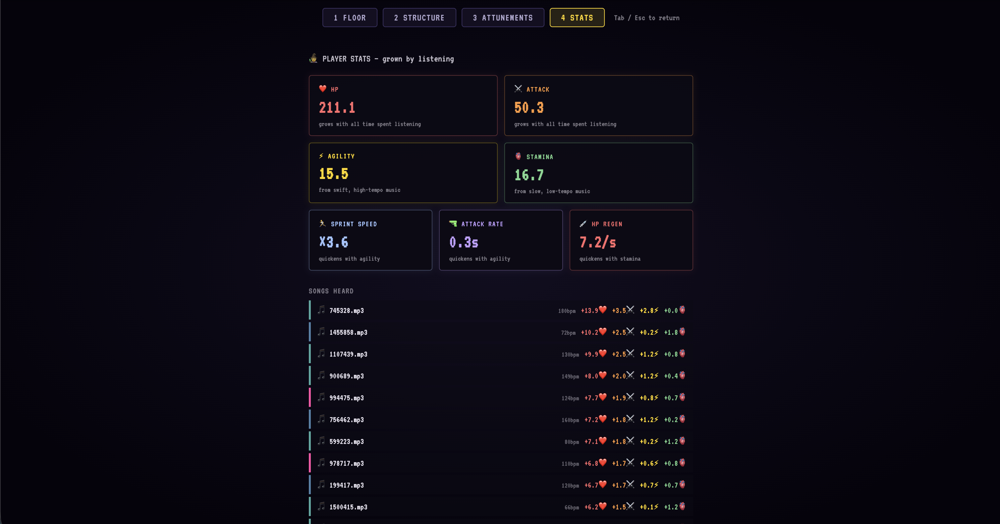
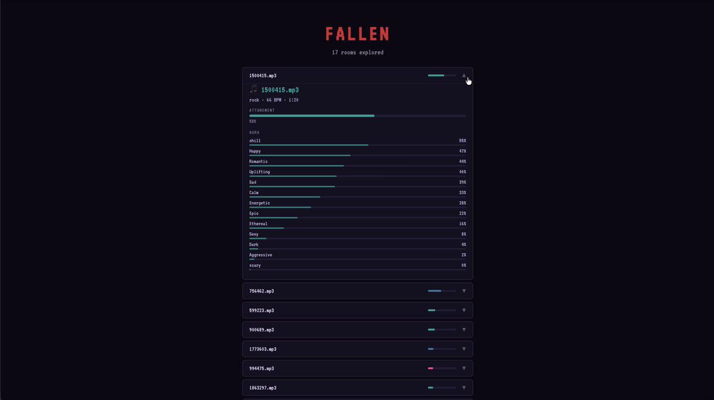

# Music Dungeon Idea

## The idea

I was thinking about music similarity graph, and I thought that it could as well be some kind of world map, tracks close in sound can be close in space. Music also has a lot of attributes and characters (mood, tempo, energy, etc.) that map naturally onto game mechanics, combining music and gaming has a huge lot of potential. So I thought I'd build a roguelike dungeon where exploring the dungeon is basically exploring music.

## What the game is

Every room is a track, its exits lead to similar tracks. Exploring the
dungeon is exploring music, exploring music is advancing the
character.

Screenshots, in order:

1. **Entrance** — search screen, type a query, land in first room.

   

2. **Combat** — enemies spawn and fight you, driven by the track playing.

   

3. **Room effects** — every track's mood carries its own buff or debuff,
   shown here across all moods.

   

4. **Dungeon structure (3D)** — whole run from outside, laid out by music.

   

5. **Attunement graph (3D)** — persistent graph of every track listened
   to across all runs, plus per-track detail on click.

   
   

6. **Stats** — player stats, derived from listening time per track only.

   

7. **Game over** — end-of-run screen.

   

## Cyanite's role

Free-text search gives the starting point.  
Similarity search gives the exploration path.  
The tagging API gives the music attributes that turn into gameplay.
